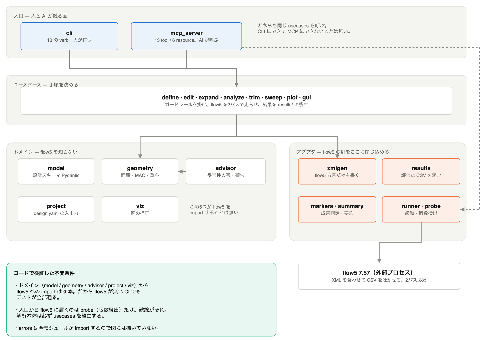

# flow5ctl

**AI-driven aircraft design with [flow5](https://flow5.tech).**

`flow5ctl` lets an AI agent — Claude Desktop, Claude Code, Codex, or any MCP client —
design and analyse low-Reynolds-number aircraft by driving flow5's headless batch engine.

It ships as one Python package with two front-ends:

| Front-end | Command | For |
|---|---|---|
| **MCP server** | `flow5ctl mcp` | Claude Desktop, and any MCP-capable client |
| **CLI** | `flow5ctl <verb>` | Claude Code, Codex, humans, CI |

13 tools, 6 resources and 4 prompts over MCP; the same capabilities as CLI verbs.
Both are thin adapters over one core, so neither can drift ahead of the other.

> **Status: the CLI and the MCP server both work.**
>
> Claude Desktop can design an aircraft with this today — see
> [docs/MCP.md](docs/MCP.md) for the one-line install. flow5ctl computes the geometry,
> generates and validates flow5's XML, computes 2D airfoil polars and caches them,
> drives the solver through the two passes it requires, solves trim conditions, runs
> parameter studies, and draws charts. 276 tests, 19 of them against a real flow5 7.57.
> Phases 1–3 of the [roadmap](docs/ROADMAP.md) are done bar Linux verification.
>
> Verified on **macOS only**, against **flow5 7.57** — Linux and Windows are the
> largest remaining risk. The [verification log](docs/log/2026-09-03-poc-verification.md)
> records what was found on the way, including a reproducible flow5 crash and seven
> ways its output misleads a naive reader; re-run any of it from [`poc/`](poc).

日本語版 README: [README.ja.md](README.ja.md)

---

## Why

flow5 is an excellent potential-flow solver, but designing an aircraft with it is a
long loop of manual GUI work: draw a planform, pick airfoils, set up a polar, run,
read graphs, adjust, repeat. That loop is exactly what an AI agent is good at —
*if* it can drive the solver reliably.

It can. flow5 has a headless batch mode (`flow5 -s script.xml`) that runs a full
plane analysis in well under a second. What it lacks is a surface an agent can
actually use: the XML schemas are large, some required fields are silently fatal if
omitted, and the results come back as wide Unicode-headed CSVs.

`flow5ctl` is that missing surface. It is **not** a thin wrapper around the flow5
binary — that would add nothing over a shell command. It is a domain layer that:

- accepts a **high-level design description** (span, taper, airfoil, mass, CG) instead of raw XML
- computes the geometry flow5 needs but does not derive in batch mode (reference area, span, MAC)
- generates and validates every XML artifact
- runs the solver, diagnoses failures in plain language
- returns **summaries an agent can reason about** (CL slope, best L/D and where, Cm_α, static margin, neutral point) rather than raw data dumps
- keeps the whole design in a **git-friendly project directory** so humans can inspect, diff and review it

How much of that is real work rather than plumbing: flow5 **segfaults** if one script
asks for both 2D and 3D work, its polar `.csv` files contain no commas, the first row
of data is welded onto the header line, `Static margin` is a percentage that looks
like a fraction, operating-point files are duplicated into every polar's directory
carrying *another* polar's contents, and a stability request on the wrong polar type
returns eigenvalues of `5.995e+51` with a straight face. Each of those is verified,
documented, and handled.

## Who it is for

`flow5ctl` targets the whole low-Re community that already uses flow5 / XFLR5:

- **Human-powered aircraft** (鳥人間コンテスト, Daedalus-class): 30 m+ span, AR ≈ 30, Re ≈ 5×10⁵–1×10⁶, ground effect, spanwise loading, structural mass budget
- **RC gliders** (F3B / F3F / F5J, DLG): 1.5–4 m span, Re ≈ 5×10⁴–3×10⁵, camber-changing flaps, ballast, wide speed range
- **Small UAVs and model aircraft** in the same regime

Presets encode the defaults each of these needs; the underlying model is general.

## Quickstart — Claude Desktop

Install flow5 from [flow5.tech](https://flow5.tech), then add one entry to Claude
Desktop's config:

```json
{
  "mcpServers": {
    "flow5": {
      "command": "uvx",
      "args": ["--from", "flow5ctl[plot]", "flow5ctl", "mcp"]
    }
  }
}
```

Restart, and ask: *"Design a 3 m F5J glider for minimum sink, then show me what moving
the CG from 30 % to 40 % MAC does."* Full setup notes, including where designs are
kept and how to point flow5ctl at an unusual flow5 install, are in
[docs/MCP.md](docs/MCP.md).

## Quickstart — command line

Install flow5 first, from [flow5.tech](https://flow5.tech). Then:

```bash
git clone https://github.com/97kuek/flow5ctl && cd flow5ctl
uv sync                          # or: pip install -e .
uv run flow5ctl doctor           # check the flow5 installation
```

```
flow5ctl      0.1.0.dev0
flow5         7.57  /Applications/flow5.app/Contents/MacOS/flow5
              verified
workspace     ~/flow5ctl  (writable)
presets       custom, hpa, rc-glider, uav
```

Describe an aircraft, then analyse it:

```yaml
# glider.yaml
preset: rc-glider
requirements: {cruise_speed: 12.0, objective: min_sink}
mass:
  components:
    - {tag: fuselage,   mass: 0.40, at: [ 0.12,  0.00, 0.00]}
    - {tag: wing_left,  mass: 0.10, at: [ 0.05, -0.75, 0.02]}
    - {tag: wing_right, mass: 0.10, at: [ 0.05,  0.75, 0.02]}
airfoils:
  - {name: AG35, source: 'naca:2409'}
wing:
  airfoil: AG35
  planform: {span: 3.0, root_chord: 0.24, taper: 0.55, dihedral: 3.0, washout: -1.5}
```

```bash
flow5ctl init Glider --file examples/rc-glider.yaml
flow5ctl analyze Glider --type T1 --speed 12 --alpha=-2,8,2
```

The 2D airfoil polars it needs are computed automatically the first time and cached
afterwards, so the first run takes about twelve seconds and later ones under a second.

### Solve, don't sweep

```bash
flow5ctl trim Glider --target level --speed 11          # α for level flight
flow5ctl trim Glider --target static-margin --value 0.10  # CG for a 10 % margin
flow5ctl trim Glider --target pitch --speed 11          # elevator incidence for Cm = 0
```

```
Solved
  cg_x                    0.07571
  static_margin           0.1006
  neutral_point_x         0.09476
  shift_from_current      0.02821

  A static margin of +10.0% needs the CG at x = 0.0757 m (39.7 % MAC), which is
  28 mm aft of the current CG. The neutral point is at x = 0.0948 m.
```

That one takes two solver runs rather than a bisection, because the neutral point does
not move with the CG — verified, so the second run only confirms the answer.

### Compare

```bash
flow5ctl sweep Glider --parameter cg_x --values 0.04:0.09:6 \
    --metrics static_margin,trim_alpha,ld_at_trim
```

```
         cg_x  static_margin   trim_alpha   ld_at_trim
  -----------  -------------  -----------  -----------
         0.04         0.3448       -0.368        4.466
         0.06           0.24       -0.001        6.485
         0.08         0.1351        0.924        11.14
         0.09         0.0827        2.286       17.297
```

`ld_at_trim`, not best L/D: moving the CG does not change the drag polar at all, only
where the aircraft trims. Ask for `best_LD` in a CG sweep and flow5ctl will tell you
the column is blind to the parameter you varied.

Studies are files, so a question survives a design change:

```bash
flow5ctl sweep Glider --study examples/cg-sweep.yaml
```

> `pipx install flow5ctl` and a PyPI release land with 0.1.0.

Claude Desktop — add to your MCP config:

```json
{
  "mcpServers": {
    "flow5": { "command": "flow5ctl", "args": ["mcp"] }
  }
}
```

Then ask: *"Design a 3 m F5J glider for minimum sink, and show me the effect of
moving the CG from 30% to 40% MAC."*

## How it works

```
                design.yaml  ← source of truth, human- and LLM-readable, in git
                     │
        flow5ctl     │  geometry solve → XML generation → validation
                     ▼
            plane.xml + polar.xml + script.xml   ← build artifacts, disposable
                     │
                     ▼
            flow5 -s script.xml                  ← headless, ~0.5 s per sweep
                     │
                     ▼
            polars.csv + oppoints/ + project.fl5
                     │
        flow5ctl     │  parse → normalise → summarise
                     ▼
            structured result + warnings  → agent
                                          → `flow5ctl open` hands the .fl5 to the GUI for a human
```

The YAML is the source; the XML is a build artifact. See
[docs/ARCHITECTURE.md](docs/ARCHITECTURE.md).



Drawn from the import graph, not from these notes — the editable source is
[docs/architecture.drawio](docs/architecture.drawio), regenerated by
[tools/gen_architecture.py](tools/gen_architecture.py). A Japanese walkthrough of the
same picture is in [docs/ARCHITECTURE-ja.md](docs/ARCHITECTURE-ja.md).

## Documentation

| Document | What it covers |
|---|---|
| [docs/ARCHITECTURE.md](docs/ARCHITECTURE.md) | Layers, data flow, why one core with two front-ends |
| [docs/ARCHITECTURE-ja.md](docs/ARCHITECTURE-ja.md) | 日本語の全体像。アーキテクチャ図つき |
| [docs/DOMAIN-MODEL.md](docs/DOMAIN-MODEL.md) | Vocabulary and the `design.yaml` schema |
| [docs/MCP.md](docs/MCP.md) | Setting up Claude Desktop, and how to read what comes back |
| [docs/MCP-TOOLS.md](docs/MCP-TOOLS.md) | The tool surface exposed to agents |
| [docs/FLOW5-INTERFACE.md](docs/FLOW5-INTERFACE.md) | Verified reference for flow5's batch/XML interface |
| [docs/DESIGN-GUIDE.md](docs/DESIGN-GUIDE.md) | Aerodynamic guardrails agents must respect |
| [docs/ROADMAP.md](docs/ROADMAP.md) | Phases and milestones |
| [docs/adr/](docs/adr/) | Architecture decision records |
| [docs/log/](docs/log/) | Investigation and verification log |
| [poc/](poc/) | The verification harness — reproduce every measured claim |
| [examples/](examples/) | Worked designs: an RC glider, an HPA, and a study |

Source layout: `src/flow5ctl/{model,geometry,advisor}` is the domain and never imports
`src/flow5ctl/flow5`, which is the only code that knows flow5 exists. `usecases/`
orchestrates; `cli.py` is a thin adapter over it, and the MCP server will be a second
one.

Contributing: [CONTRIBUTING.md](CONTRIBUTING.md) · Working with AI agents in this repo: [AGENTS.md](AGENTS.md)

## Known limitations

- **Flaps and control surfaces are not supported, and cannot be.** flow5 has no flap
  or hinge elements in its plane XML — a flap belongs to flow5's Foil object, which a
  `.dat` file cannot carry, and planes loaded from a GUI-made project cannot be paired
  with new analyses. So T6 control polars are out of reach through this interface.
  This matters if you fly camber-changing RC gliders; see
  [the verification log](docs/log/2026-09-03-poc-verification.md), findings 9 and 10.
- **Verified on macOS only.** Linux and Windows are expected to work and are
  untested — reports very welcome.
- **flow5's own defects are inherited.** Dutch-roll and short-period frequencies are
  unreliable in 7.57 and are deliberately not reported.

## Relationship to flow5

flow5 is a separate project by André Deperrois, released under GPL-3.0 at
[techwinder/flow5](https://github.com/techwinder/flow5). `flow5ctl` is an
independent tool that invokes the flow5 executable as a subprocess. It does not
link flow5 code and does not redistribute it — you install flow5 yourself.
See [ADR-0006](docs/adr/0006-licensing-and-the-gpl-boundary.md).

`flow5ctl` is not affiliated with or endorsed by the flow5 project.

## License

Apache-2.0 (proposed — see [ADR-0006](docs/adr/0006-licensing-and-the-gpl-boundary.md)).
